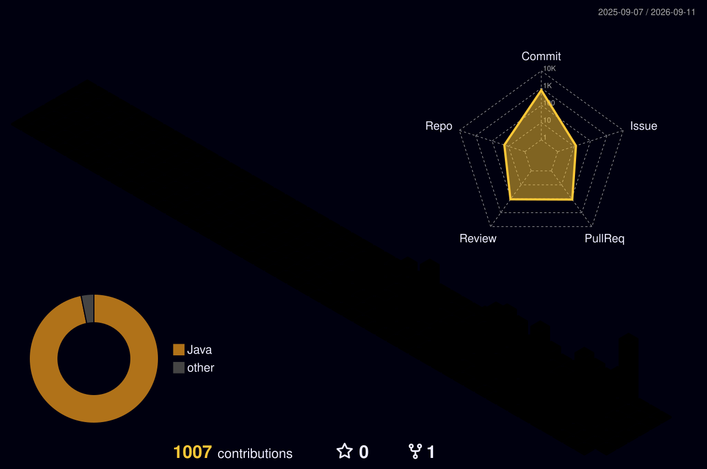

# 안녕하세요, 백엔드 개발자를 준비하는 박정원입니다.

**기록과 문서화로 문제를 재현하고, 다시 활용할 수 있는 해결책을 만듭니다.**

---

## About Me

- Java와 Spring Boot를 중심으로 웹 백엔드를 학습하고 개발하고 있습니다.
- 도메인 규칙과 데이터 정합성을 코드, 테스트, 문서로 확인하는 과정을 중요하게 생각합니다.
- 오류의 원인과 해결 과정을 기록해 다음 문제 해결과 협업에 다시 활용합니다.
- 결제, 동시성, 실시간 통신, AI 연동이 포함된 팀 프로젝트를 경험했습니다.

## Tech Stack

### Main

### Used in Projects

### Web & Collaboration

## Featured Projects

### [읽어볼까](https://github.com/Ilgeobolkka/Ilgeobolkka)

책 전체를 구매하기 전에 필요한 페이지부터 읽고, 독서 목적과 예산에 맞는 페이지 읽기 순서를 AI가 제안하는 데스크톱 웹 서비스입니다.

- **주요 경험:** 페이지 단위 대여, 온라인 소장, 결제 검증, AI 독서 경로, 데이터 정합성 검증
- **기술:** Java 21, Spring Boot 4.1, Spring Data JPA, MySQL, Thymeleaf, OpenAI API, PortOne

### [전자제품 커머스 플랫폼](https://github.com/nongbu24/team3-plus-spring)

선착순 쿠폰의 동시성 제어, 결제 멱등성, 실시간 상담 채팅과 AI 상담을 구현한 Spring Boot 기반 팀 프로젝트입니다.

- **담당:** 인증·인가, WebSocket 기반 실시간 1:1 채팅
- **기술:** Java 17, Spring Boot 4.1, MySQL, Redis, QueryDSL, WebSocket, Docker

## GitHub Activity

  
  

## 3D Contribution Graph

